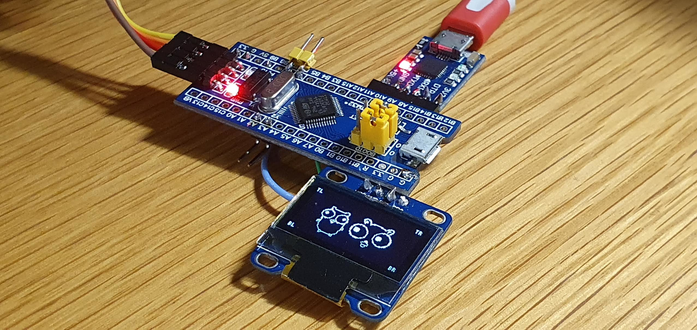

# TinyGo Blue Pill project

<!-- vim-markdown-toc GFM -->

* [Resources](#resources)
	* [HARDWARE STM32F103C8T6](#hardware-stm32f103c8t6)
	* [TinyGo](#tinygo)
	* [TinyGo Drivers](#tinygo-drivers)
	* [TinyDraw / TinyFont](#tinydraw--tinyfont)
	* [TinyGo examples](#tinygo-examples)

<!-- vim-markdown-toc -->

## Resources

### HARDWARE STM32F103C8T6
- general https://stm32-base.org/boards/STM32F103C8T6-Blue-Pill
- schematic https://stm32-base.org/assets/pdf/boards/original-schematic-STM32F103C8T6-Blue_Pill.pdf

### TinyGo
- https://github.com/tinygo-org/tinygo
- https://github.com/tinygo-org/tinygo/blob/release/src/machine/board_bluepill.go
- https://github.com/tinygo-org/tinygo/blob/release/src/runtime/runtime_stm32f103xx.go
- https://github.com/tinygo-org/tinygo/blob/release/src/machine/board_stm32.go

### TinyGo Drivers
- https://github.com/tinygo-org/drivers
- https://github.com/tinygo-org/drivers/tree/release/ssd1306

### TinyDraw / TinyFont
- https://github.com/tinygo-org/tinyfont
- https://github.com/tinygo-org/tinyfont/blob/master/tinyfont.go
- https://github.com/tinygo-org/tinyfont/blob/master/examples/epd/main.go
- http://2ttf.com/HCQ3PvcaQ4U

### TinyGo examples
- https://www.hackster.io/alankrantas/tinygo-on-arduino-uno-an-introduction-6130f6
- flightstick https://gist.github.com/deadprogram/9e9b8fe7931007c30a0ff71f98ed691e
